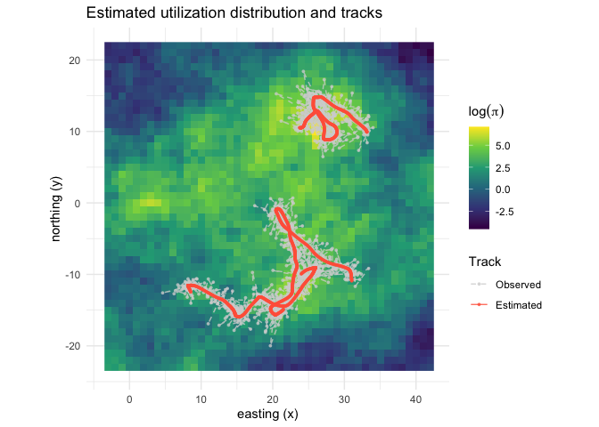
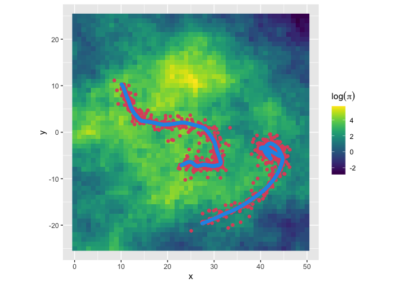
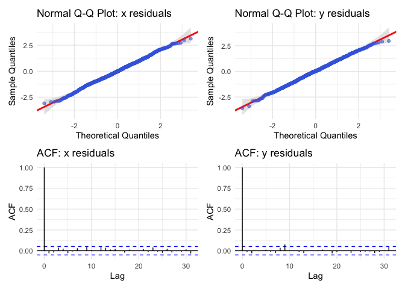

<!-- README.md is generated from README.Rmd. Please edit that file -->

# {langevinSSM}

#### Habitat-driven Langevin Diffusion with Spatial Uncertainty

`{langevinSSM}` is an R package for simulating and fitting the
habitat-driven Langevin diffusion to animal tracking data subject to
location measurement error and temporal irregularity. The habitat-driven
Langevin diffusion can provide inferences about habitat selection and
utilization distributions. The package provides tools for simulating
animal movement paths (`simLangevin`) and fitting the Langevin diffusion
model to observed tracking data (`fitLangevin`). Location measurement
error can take the form of either (older) Argos Least Squares-based
locations or (newer) Argos Kalman Filter-based locations with error
ellipse information. The Langevin diffusion is a continuous-time model
in state-space form that estimates the underlying movement process while
accounting for location measurement error and associated uncertainty in
the spatial (habitat) covariates. Template Model Builder {TMB} is used
for fast estimation.

## Installation

One can install the `langevinSSM` package from CRAN using the following
command:

``` r
install.packages("langevinSSM") 
```

Alternatively, one can install the package from GitHub using the
`remotes` package:

``` r
remotes::install_github("bmcclintock/langevinSSM")
```

## Usage

To simulate animal movement paths using the Langevin diffusion model,
one can use the `simLangevin` function. For example:

``` r
library(langevinSSM)
library(ggplot2)
library(terra)
library(patchwork)

# Simulate an underdamped Langevin diffusion path

par <- list(beta = c(-4, 6, 5, -0.1), # habitat selection coefficients
            sigma = 5, # diffusion (or speed) parameter
            gamma = 0.5) # autocorrelation parameter

# calculate the true utiliziation distribution
## exampleCovs is a list of four spatial covariates (e.g., habitat features) that loads with the package
trueUD <- getUD(spatialCovs = exampleCovs, beta = par$beta)
```

<!-- -->

``` r

simDat <- simLangevin(model = "underdamped",
                      par = par,
                      spatialCovs = exampleCovs,
                      nbAnimals = 3)

head(simDat)
#>   id date   dt        x        y smaj smin eor x.err y.err     mu.x     mu.y
#> 1  1 0.00 0.00 1024.000 990.0000   NA   NA  NA    NA    NA 1024.000 990.0000
#> 2  1 0.01 0.01 1024.067 990.0602   NA   NA  NA    NA    NA 1024.067 990.0602
#> 3  1 0.02 0.01 1024.130 990.1191   NA   NA  NA    NA    NA 1024.130 990.1191
#> 4  1 0.03 0.01 1024.195 990.1747   NA   NA  NA    NA    NA 1024.195 990.1747
#> 5  1 0.04 0.01 1024.256 990.2287   NA   NA  NA    NA    NA 1024.256 990.2287
#> 6  1 0.05 0.01 1024.315 990.2791   NA   NA  NA    NA    NA 1024.315 990.2791
#>      vel.x    vel.y
#> 1 6.648996 6.362147
#> 2 6.341045 5.739271
#> 3 6.837852 5.723017
#> 4 6.165345 5.344009
#> 5 5.949173 5.076844
#> 6 5.844776 5.189753

# Simulate an underdamped Langevin diffusion path with measurement error
measurementError <- list(smaj.sd = 1.5,      # sd of semi-major axis of error ellipse
                         smin.sd = 0.75,     # sd of semi-minor axis of error ellipse
                         eor.lim = c(0,180)) # range of ellipse orientation (in degrees from north)

set.seed(1, kind="Mersenne-Twister", normal.kind="Inversion")

head(exampleDat)
#>   id date   dt        x        y      smaj      smin       eor x.err y.err
#> 1  1 0.00 0.00 1023.610 988.7225 3.1904213 0.8238468 0.4407540    NA    NA
#> 2  1 0.01 0.01 1024.056 990.0353 0.2602149 0.1929297 0.8419944    NA    NA
#> 3  1 0.02 0.01 1022.943 991.0823 1.9072127 0.6294832 2.2160981    NA    NA
#> 4  1 0.03 0.01 1024.243 990.1201 0.1952989 0.0469546 2.2100417    NA    NA
#> 5  1 0.04 0.01 1024.996 990.5625 1.4343749 1.1175133 2.8685380    NA    NA
#> 6  1 0.05 0.01 1024.489 990.9043 0.8349596 0.1392169 0.4690632    NA    NA
#>       mu.x     mu.y    vel.x    vel.y
#> 1 1024.000 990.0000 6.648996 6.362147
#> 2 1024.067 990.0602 6.341045 5.739271
#> 3 1024.130 990.1191 6.837852 5.723017
#> 4 1024.195 990.1747 6.165345 5.344009
#> 5 1024.256 990.2287 5.949173 5.076844
#> 6 1024.315 990.2791 5.844776 5.189753
```

To fit the Langevin diffusion model to observed tracking data, one can
use the `formatData` and `fitLangevin` functions. For example:

``` r
# unformatDat is example data appropriate for formatData that loads with the package
head(unformatDat)
#>   id                date        x        y      smaj      smin       eor x.err
#> 1  1 2026-04-11 00:00:00 1023.610 988.7225 3.1904213 0.8238468  25.25334    NA
#> 2  1 2026-04-11 00:00:36 1024.056 990.0353 0.2602149 0.1929297  48.24272    NA
#> 3  1 2026-04-11 00:01:12 1022.943 991.0823 1.9072127 0.6294832 126.97307    NA
#> 4  1 2026-04-11 00:01:48 1024.243 990.1201 0.1952989 0.0469546 126.62606    NA
#> 5  1 2026-04-11 00:02:24 1024.996 990.5625 1.4343749 1.1175133 164.35512    NA
#> 6  1 2026-04-11 00:03:00 1024.489 990.9043 0.8349596 0.1392169  26.87534    NA
#>   y.err
#> 1    NA
#> 2    NA
#> 3    NA
#> 4    NA
#> 5    NA
#> 6    NA

# format the data for fitLangevin
exampleDat <- formatData(unformatDat, time.unit = "hours")

head(exampleDat)
#>   id                date   dt        x        y   lc      smaj      smin
#> 1  1 2026-04-11 00:00:00 0.00 1023.610 988.7225 <NA> 3.1904213 0.8238468
#> 2  1 2026-04-11 00:00:36 0.01 1024.056 990.0353 <NA> 0.2602149 0.1929297
#> 3  1 2026-04-11 00:01:12 0.01 1022.943 991.0823 <NA> 1.9072127 0.6294832
#> 4  1 2026-04-11 00:01:48 0.01 1024.243 990.1201 <NA> 0.1952989 0.0469546
#> 5  1 2026-04-11 00:02:24 0.01 1024.996 990.5625 <NA> 1.4343749 1.1175133
#> 6  1 2026-04-11 00:03:00 0.01 1024.489 990.9043 <NA> 0.8349596 0.1392169
#>         eor x.err y.err
#> 1 0.4407540    NA    NA
#> 2 0.8419944    NA    NA
#> 3 2.2160981    NA    NA
#> 4 2.2100417    NA    NA
#> 5 2.8685380    NA    NA
#> 6 0.4690632    NA    NA

# Fit the underdamped Langevin diffusion model to simulated data with measurement error
## setting calcResiduals = TRUE will calculate one-step-ahead residuals for model diagnostics
fit <- fitLangevin(model = "underdamped",
                   data = exampleDat,
                   spatialCovs = exampleCovs,
                   silent = TRUE,
                   calcResiduals = TRUE)  

fit
#> 
#> Habitat-Driven Langevin Diffusion Model
#> =======================================
#> Model type:        Underdamped 
#> Convergence:       Successful 
#> Max Log-Likelihood: -2061.97 
#> Optimization time:  0.62 seconds
#> 
#> Parameter Estimates (Natural Scale):
#> ---------------------------------------
#>           Estimate Std. Error
#> beta_cov1  -3.5437      1.250
#> beta_cov2   8.6136      2.295
#> beta_cov3   7.5113      1.948
#> beta_d2c   -0.3084      0.324
#> sigma       4.3092      0.500
#> gamma       0.5850      0.145
#> rho_o       0.0000      0.000
#> tau_1       1.0000      0.000
#> tau_2       1.0000      0.000
#> psi         1.0000      0.000
#> 
#> --- OSA Goodness-of-Fit Results ---
#>  metric  statistic   p.value
#>    KS_x 0.01599200 0.8385286
#>    KS_y 0.02434843 0.3373330
#>  KS_mah 0.01965255 0.6097253
#>    LB_x 7.88968961 0.3424215
#>    LB_y 3.28845523 0.8570979
#>  LB_mah 5.37979230 0.6137200
#> -----------------------------------

# calculate the estimated UD
UD <- getUD(spatialCovs = exampleCovs, fit = fit)
```

<!-- -->

``` r

# plot the estimated (log) UD with the observed and estimated locations
plot(fit, spatialCovs = exampleCovs, data = exampleDat)
```

<!-- -->

``` r

# plot residuals to check model fit
p <- plotResiduals(fit)
p$qq_x + p$qq_y + p$acf_x + p$acf_y + plot_layout(ncol=2)
```

<!-- -->

``` r

# calculate similarity of true and estimated UDs using Bhattacharyya's affinity
rasterOverlap(exp(UD), exp(trueUD))
#>    log_UD 
#> 0.9088081

# calculate probability of being in specified region
## create a spatial mask for the region of interest
d2c <- exampleCovs$d2c < 2.5
reg_prob <- regionProb(fit,
                       spatialCovs = exampleCovs, 
                       mask = d2c, # region of interest
                       show_progress = FALSE)

reg_prob$Point_Estimate # point estimate
#> [1] 0.3098513
reg_prob$CI_sim_95 # 95% Monte Carlo credible interval
#> [1] 1.954616e-53 7.103307e-01
```

## Citation

If you use `{langevinSSM}` in your research, please cite it as follows:

    To cite package 'langevinSSM' in publications use:

      Dupont, F., McClintock, B.T., Fischer, J.-O., Marcoux, M., Hussey,
      N., and Auger-Méthé, M. (2025). Inferring resource selection and
      utilization distributions from irregular and error-prone animal
      tracking data using the habitat-driven Langevin diffusion.

    A BibTeX entry for LaTeX users is

      @Article{,
        title = {Inferring resource selection and utilization distributions from irregular and error-prone animal tracking data using the habitat-driven Langevin diffusion},
        author = {Fanny Dupont and Brett T. McClintock and Jan-Ole Fischer and Marianne Marcoux and Nigel Hussey and Marie Auger-Méthé},
        journal = {TBD},
        year = {2025},
      }

    Additions and modifications to langevinSSM are frequent, to help with
    reproducibility of output please cite its version number. This is
    'langevinSSM' version 0.0.1
