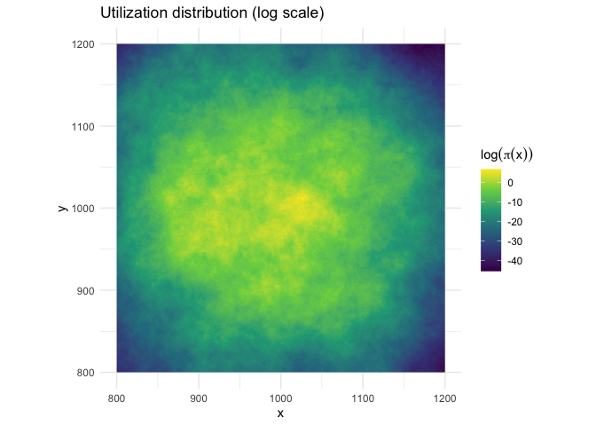
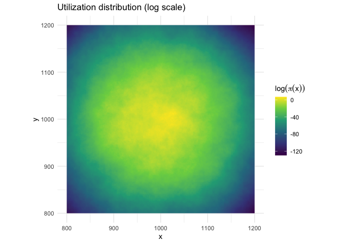
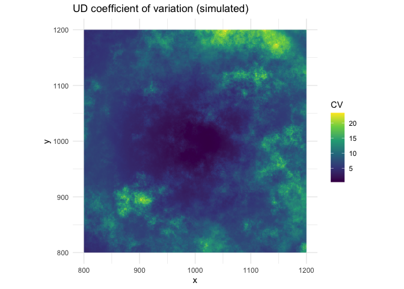
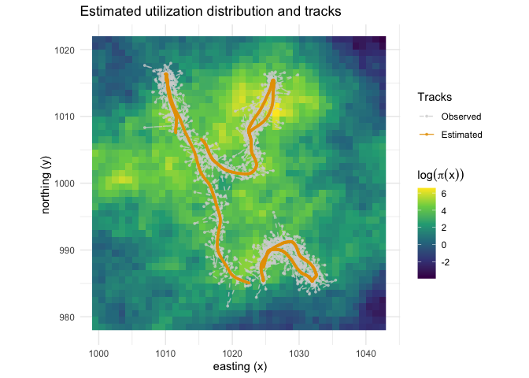
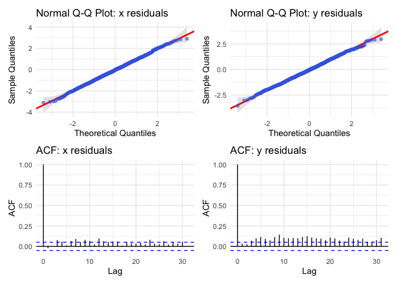
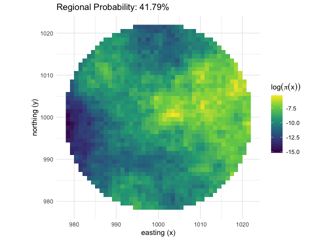
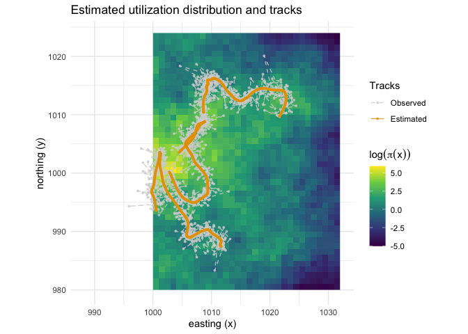

<!-- README.md is generated from README.Rmd. Please edit that file -->

# {langevinSSM}

#### Habitat-driven Langevin Diffusion with Spatial Uncertainty

`{langevinSSM}` is an R package for simulating and fitting the
habitat-driven Langevin diffusion to animal tracking data subject to
location measurement error and temporal irregularity. The habitat-driven
Langevin diffusion provides inferences about both habitat selection and
utilization distributions. The package provides tools for simulating
animal movement paths (`simLangevin`) and fitting the Langevin diffusion
model to observed tracking data (`fitLangevin`). Location measurement
error can take the form of (older) Argos Least Squares-based locations,
(newer) Argos Kalman Filter-based locations with error ellipse
information, or general x- and y-axis errors (e.g. for GPS data). The
Langevin diffusion is a continuous-time model in state-space form that
estimates the underlying movement process while accounting for location
measurement error and associated uncertainty in the spatial (habitat)
covariates. Template Model Builder {TMB} is used for fast estimation.

## Installation

One can install the `langevinSSM` package from CRAN using the following
command:

``` r
install.packages("langevinSSM") 
```

Alternatively, one can install the package from GitHub using the
`remotes` package:

``` r
remotes::install_github("bmcclintock/langevinSSM")
```

## Usage

To simulate animal movement paths using the Langevin diffusion model,
one can use the `simLangevin` function. For example:

``` r
library(langevinSSM)
library(ggplot2)
library(terra)
library(patchwork)

# Simulate an underdamped Langevin diffusion path

par <- list(beta = c(-4, 6, 5, -0.1), # habitat selection coefficients
            sigma = 5, # diffusion (or speed) parameter
            gamma = 0.5) # autocorrelation parameter

# calculate the true utiliziation distribution
## exampleCovs is a list of four spatial covariates (e.g., habitat features) that loads with the package
trueUD <- getUD(spatialCovs = exampleCovs, beta = par$beta)
```

<!-- -->

``` r

simDat <- simLangevin(model = "underdamped",
                      par = par,
                      spatialCovs = exampleCovs,
                      nbAnimals = 3)

head(simDat)
#>   id date   dt        x        y smaj smin eor x.err y.err     mu.x     mu.y
#> 1  1 0.00 0.00 1022.500 1007.500   NA   NA  NA    NA    NA 1022.500 1007.500
#> 2  1 0.01 0.01 1022.568 1007.561   NA   NA  NA    NA    NA 1022.568 1007.561
#> 3  1 0.02 0.01 1022.635 1007.623   NA   NA  NA    NA    NA 1022.635 1007.623
#> 4  1 0.03 0.01 1022.706 1007.684   NA   NA  NA    NA    NA 1022.706 1007.684
#> 5  1 0.04 0.01 1022.776 1007.746   NA   NA  NA    NA    NA 1022.776 1007.746
#> 6  1 0.05 0.01 1022.846 1007.807   NA   NA  NA    NA    NA 1022.846 1007.807
#>      vel.x    vel.y
#> 1 6.648996 6.362147
#> 2 6.594244 5.901401
#> 3 7.340222 6.150873
#> 4 6.912809 6.033203
#> 5 6.937667 6.022787
#> 6 7.070177 6.387858

# Simulate an underdamped Langevin diffusion path with measurement error
measurementError <- list(smaj.sd = 1.5,      # sd of semi-major axis of error ellipse
                         smin.sd = 0.75,     # sd of semi-minor axis of error ellipse
                         eor.lim = c(0,180)) # range of ellipse orientation (in degrees from north)

exampleDat <- simLangevin(model = "underdamped",
                         par = par,
                         spatialCovs = exampleCovs,
                         nbAnimals = 3,
                         obsPerAnimal = 500,
                         measurementError = measurementError)

head(exampleDat)
#>   id date   dt        x        y      smaj      smin       eor x.err y.err
#> 1  1 0.00 0.00 1022.110 1006.222 3.1904213 0.8238468 0.4407540    NA    NA
#> 2  1 0.01 0.01 1022.557 1007.536 0.2602149 0.1929297 0.8419944    NA    NA
#> 3  1 0.02 0.01 1021.448 1008.586 1.9072127 0.6294832 2.2160981    NA    NA
#> 4  1 0.03 0.01 1022.754 1007.629 0.1952989 0.0469546 2.2100417    NA    NA
#> 5  1 0.04 0.01 1023.516 1008.080 1.4343749 1.1175133 2.8685380    NA    NA
#> 6  1 0.05 0.01 1023.020 1008.433 0.8349596 0.1392169 0.4690632    NA    NA
#>       mu.x     mu.y    vel.x    vel.y
#> 1 1022.500 1007.500 6.648996 6.362147
#> 2 1022.568 1007.561 6.594244 5.901401
#> 3 1022.635 1007.623 7.340222 6.150873
#> 4 1022.706 1007.684 6.912809 6.033203
#> 5 1022.776 1007.746 6.937667 6.022787
#> 6 1022.846 1007.807 7.070177 6.387858
```

To fit the Langevin diffusion model to observed tracking data, one can
use the `formatData` and `fitLangevin` functions. For example:

``` r
# unformatDat is example data appropriate for formatData that loads with the package
head(unformatDat)
#>   id                date        x        y      smaj      smin       eor x.err
#> 1  1 2026-05-05 00:00:00 1022.110 1006.222 3.1904213 0.8238468  25.25334    NA
#> 2  1 2026-05-05 00:00:36 1022.557 1007.536 0.2602149 0.1929297  48.24272    NA
#> 3  1 2026-05-05 00:01:12 1021.448 1008.586 1.9072127 0.6294832 126.97307    NA
#> 4  1 2026-05-05 00:01:48 1022.754 1007.629 0.1952989 0.0469546 126.62606    NA
#> 5  1 2026-05-05 00:02:24 1023.516 1008.080 1.4343749 1.1175133 164.35512    NA
#> 6  1 2026-05-05 00:03:00 1023.020 1008.433 0.8349596 0.1392169  26.87534    NA
#>   y.err
#> 1    NA
#> 2    NA
#> 3    NA
#> 4    NA
#> 5    NA
#> 6    NA

# format the data for fitLangevin
exampleDat <- formatData(unformatDat, time.unit = "hours")

head(exampleDat)
#>   id                date   dt        x        y   lc      smaj      smin
#> 1  1 2026-05-05 00:00:00 0.00 1022.110 1006.222 <NA> 3.1904213 0.8238468
#> 2  1 2026-05-05 00:00:36 0.01 1022.557 1007.536 <NA> 0.2602149 0.1929297
#> 3  1 2026-05-05 00:01:12 0.01 1021.448 1008.586 <NA> 1.9072127 0.6294832
#> 4  1 2026-05-05 00:01:48 0.01 1022.754 1007.629 <NA> 0.1952989 0.0469546
#> 5  1 2026-05-05 00:02:24 0.01 1023.516 1008.080 <NA> 1.4343749 1.1175133
#> 6  1 2026-05-05 00:03:00 0.01 1023.020 1008.433 <NA> 0.8349596 0.1392169
#>         eor x.err y.err
#> 1 0.4407540    NA    NA
#> 2 0.8419944    NA    NA
#> 3 2.2160981    NA    NA
#> 4 2.2100417    NA    NA
#> 5 2.8685380    NA    NA
#> 6 0.4690632    NA    NA

# Fit the overdamped Langevin diffusion model to simulated data with measurement error
fit_over <- fitLangevin(model = "overdamped",
                   data = exampleDat,
                   spatialCovs = exampleCovs,
                   silent = TRUE)  

fit_over
#> 
#> Habitat-Driven Langevin Diffusion Model
#> =======================================
#> Model type:        Overdamped 
#> Convergence:       Successful 
#> Max Log-Likelihood: -2533.968 
#> Optimization time:  0.37 seconds
#> 
#> Parameter Estimates (Natural Scale):
#> ---------------------------------------
#>           Estimate Std. Error
#> beta_cov1  -11.226      6.183
#> beta_cov2    4.472      6.137
#> beta_cov3    1.189      5.766
#> beta_d2c     1.204      1.538
#> sigma        1.379      0.040
#> rho_o        0.000      0.000
#> tau_1        1.000      0.000
#> tau_2        1.000      0.000
#> psi          1.000      0.000

# Fit the underdamped Langevin diffusion model
fit_under <- fitLangevin(model = "underdamped",
                   data = exampleDat,
                   spatialCovs = exampleCovs,
                   silent = TRUE)  

fit_under
#> 
#> Habitat-Driven Langevin Diffusion Model
#> =======================================
#> Model type:        Underdamped 
#> Convergence:       Successful 
#> Max Log-Likelihood: -2056.739 
#> Optimization time:  0.72 seconds
#> 
#> Parameter Estimates (Natural Scale):
#> ---------------------------------------
#>           Estimate Std. Error
#> beta_cov1  -4.4965      1.407
#> beta_cov2   6.1584      1.733
#> beta_cov3   5.4965      1.561
#> beta_d2c   -0.3116      0.234
#> sigma       4.6220      0.532
#> gamma       0.4628      0.111
#> rho_o       0.0000      0.000
#> tau_1       1.0000      0.000
#> tau_2       1.0000      0.000
#> psi         1.0000      0.000
```

### Post-processing functions

#### Utilization distribution

``` r
# calculate the estimated UD
UD <- getUD(spatialCovs = exampleCovs, 
            fit = fit_under, 
            nSims = 1000, # Monte Carlo simulation
            show_progress = FALSE)
```

<!-- -->

``` r

p_UD <- plotUD(UD)

# UD relative uncertainty (Delta method approximation)
p_UD$CV_delta
```

<!-- -->

``` r

# UD relative uncertainty (Monte Carlo simulation)
p_UD$CV_sim
```

<!-- -->

``` r

# plot the estimated (log) UD with the observed and estimated locations
plot(fit_under, spatialCovs = exampleCovs, data = exampleDat)
```

<!-- -->

#### Other S3 methods for `fitLangevin` objects

``` r
# fixed effect estimates
coef(fit_under) 
#>  beta_cov1  beta_cov2  beta_cov3   beta_d2c      sigma      gamma      rho_o 
#> -4.4965009  6.1584439  5.4964942 -0.3116450  4.6220487  0.4627646  0.0000000 
#>      tau_1      tau_2        psi 
#>  1.0000000  1.0000000  1.0000000

# confidence intervals for fixed effects
confint(fit_under) 
#>                2.5 %     97.5 %
#> beta_cov1 -7.2537135 -1.7392882
#> beta_cov2  2.7612086  9.5556792
#> beta_cov3  2.4372607  8.5557277
#> beta_d2c  -0.7705083  0.1472183
#> sigma      3.5793405  5.6647569
#> gamma      0.2445545  0.6809747
#> rho_o      0.0000000  0.0000000
#> tau_1      1.0000000  1.0000000
#> tau_2      1.0000000  1.0000000
#> psi        1.0000000  1.0000000

# confidence intervals for true locations
mu_ci <- confint(fit_under, type= "mu") 

head(mu_ci)
#>   id                date mu.x_2.5% mu.x_97.5% mu.y_2.5% mu.y_97.5%
#> 1  1 2026-05-05 00:00:00  1022.299   1022.595  1007.434   1007.690
#> 2  1 2026-05-05 00:00:36  1022.377   1022.636  1007.501   1007.724
#> 3  1 2026-05-05 00:01:12  1022.454   1022.681  1007.567   1007.763
#> 4  1 2026-05-05 00:01:48  1022.531   1022.730  1007.631   1007.807
#> 5  1 2026-05-05 00:02:24  1022.607   1022.784  1007.693   1007.856
#> 6  1 2026-05-05 00:03:00  1022.683   1022.842  1007.753   1007.908

# AIC for comparing models with different fixed effects
AIC(fit_under) 
#> [1] 4125.478

# BIC for comparing models with different fixed effects
BIC(fit_under) 
#> [1] 4157.358
```

#### One-step-ahead residuals

``` r
# calculate one-step-ahead residuals for model diagnostics
res_under <- residuals(fit_under, data = exampleDat, spatialCovs = exampleCovs, ncores = 3)
res_under
#> 
#> === One-Step-Ahead (OSA) Residuals ===
#> Total observations: 1500 
#> Number of tracks:   3 
#> 
#> ---- Goodness-of-Fit Tests ----
#>  metric  statistic   p.value
#>    KS_x 0.01598432 0.8389506
#>    KS_y 0.02434843 0.3373330
#>  KS_mah 0.01965255 0.6097253
#>    LB_x 7.88961085 0.3424286
#>    LB_y 3.28849949 0.8570934
#>  LB_mah 5.37975199 0.6137248
#> -------------------------------
#> 
#> Residual Summary:
#>    residual.x           residual.y      
#>  Min.   :-3.0898455   Min.   :-3.57833  
#>  1st Qu.:-0.6737108   1st Qu.:-0.66399  
#>  Median :-0.0125678   Median : 0.01314  
#>  Mean   : 0.0003674   Mean   : 0.01898  
#>  3rd Qu.: 0.6900477   3rd Qu.: 0.71835  
#>  Max.   : 3.1302167   Max.   : 2.97038  
#>  NA's   :3            NA's   :3

# plot residuals to check model fit
p_under <- plot(res_under)
p_under$qq_x + p_under$qq_y + p_under$acf_x + p_under$acf_y + plot_layout(ncol=2)
```

<!-- -->

``` r

# can be used to compare "underdamped" vs "overdamped" models
res_over <- residuals(fit_over, data = exampleDat, spatialCovs = exampleCovs, ncores = 3)
res_over
#> 
#> === One-Step-Ahead (OSA) Residuals ===
#> Total observations: 1500 
#> Number of tracks:   3 
#> 
#> ---- Goodness-of-Fit Tests ----
#>  metric   statistic      p.value
#>    KS_x  0.02500516 3.065233e-01
#>    KS_y  0.02854070 1.744104e-01
#>  KS_mah  0.01735706 7.579011e-01
#>    LB_x 33.14761549 2.485147e-05
#>    LB_y 65.63052339 1.123146e-11
#>  LB_mah  6.54028837 4.782583e-01
#> -------------------------------
#> 
#> Residual Summary:
#>    residual.x         residual.y      
#>  Min.   :-3.11105   Min.   :-3.55955  
#>  1st Qu.:-0.67883   1st Qu.:-0.72711  
#>  Median :-0.02908   Median :-0.05798  
#>  Mean   :-0.03422   Mean   :-0.04454  
#>  3rd Qu.: 0.63190   3rd Qu.: 0.63178  
#>  Max.   : 2.89999   Max.   : 2.94656  
#>  NA's   :3          NA's   :3

p_over <- plot(res_over)
p_over$qq_x + p_over$qq_y + p_over$acf_x + p_over$acf_y + plot_layout(ncol=2)
```

<!-- -->

#### Bhattacharyya’s affinity

``` r
# calculate similarity of true and estimated UDs using Bhattacharyya's affinity
rasterOverlap(exp(UD), exp(trueUD))
#> [1] 0.9074143
```

#### Regional presence probability

``` r
# create a spatial mask for the region of interest
d2c <- exampleCovs$d2c < 2.5

reg_prob <- regionProb(fit_under,
                       spatialCovs = exampleCovs, 
                       mask = d2c, # region of interest
                       nSims = 1000, # number of Monte Carlo simulations
                       show_progress = FALSE)

reg_prob
#> Regional Probability Estimate
#> =============================
#> Point Estimate: 0.4179
#> 
#> Delta Method Approximation:
#>   Standard Error: 0.1752
#>   95% CI:         [0.0745, 0.7614]
#> 
#> Monte Carlo Simulation:
#>   Standard Error: 0.2018
#>   95% CI:         [0.0000, 0.7322]
#>   (Based on 1000 draws)

plot(reg_prob, log = TRUE)
```

<!-- -->

### Spatial constraints (i.e., barriers)

To include barriers to movement (e.g., land for marine animals), the
`prepBarrier` function can be used to create a signed distance field
(SDF) from a binary raster mask (where 1 indicates allowed movement
areas and 0 indicates restricted movement areas). The SDF is then
included as a habitat selection covariate (where negative coefficients
indicate attraction to the barrier boundary, e.g., the coast for marine
animals) and as part of a penalty term with strength `lambda`:

``` r
# create a dummy barrier mask (left half restricted = 0, right half allowed = 1)
coast_barrier <- exampleCovs[[1]]
terra::values(coast_barrier) <- ifelse(terra::crds(coast_barrier)[, "x"]
                                 >= mean(terra::crds(coast_barrier)[, "x"]), 1, 0)
names(coast_barrier) <- "coast_barrier"

# convert mask to SDF and add to the spatial covariates list
exampleCovs_barrier <- exampleCovs
exampleCovs_barrier$coast_barrier <- prepBarrier(coast_barrier)

# add a beta coefficient for the barrier to the parameter list
# negative value indicates slight attraction to the "coast"
par_barrier <- par
par_barrier$beta <- c(par_barrier$beta, -0.2)

# simulate the data
set.seed(1,kind="Mersenne-Twister",normal.kind="Inversion")
simDat_barrier <- simLangevin(par = par_barrier,
                              nbAnimals = 3,
                              spatialCovs = exampleCovs_barrier,
                              measurementError = list(smaj.sd = 1.5,
                                                      smin.sd = 0.75,
                                                      eor.lim = c(0,180)))

# actual penalty (lambda)
attr(simDat_barrier,"lambda")
#> [1] 4.003336

# Because by default lambda=NULL and simDat_barrier is a simLangevin object, 
# fitLangevin will automatically detect and use the exact barrier penalty (lambda) 
# that generated the data
fit_barrier <- fitLangevin(data = simDat_barrier,
                           spatialCovs = exampleCovs_barrier,
                           silent = TRUE)
fit_barrier
#> 
#> Habitat-Driven Langevin Diffusion Model
#> =======================================
#> Model type:        Underdamped 
#> Convergence:       Successful 
#> Max Log-Likelihood: -2054.328 
#> Optimization time:  0.81 seconds
#> Barrier penalty:    4.003 
#> 
#> Parameter Estimates (Natural Scale):
#> ---------------------------------------
#>                    Estimate Std. Error
#> beta_cov1          -5.69776      1.397
#> beta_cov2           6.71585      1.604
#> beta_cov3           4.46631      1.210
#> beta_d2c            0.05763      0.543
#> beta_coast_barrier -0.24950      0.089
#> sigma               4.59473      0.426
#> gamma               0.48286      0.104
#> rho_o               0.00000      0.000
#> tau_1               1.00000      0.000
#> tau_2               1.00000      0.000
#> psi                 1.00000      0.000

plot(fit_barrier, data = simDat_barrier,
                  spatialCovs = exampleCovs_barrier,
                  maskBarrier = TRUE)
```

<!-- -->

``` r

# Using a grid search, posterior predictive checks can be 
# performed to select the penalty via the tuneBarrier function
fit_barrier_ks <- tuneBarrier(data = simDat_barrier,
                              spatialCovs = exampleCovs_barrier,
                              n_sims = 10,
                              n_coarse = 5,
                              n_fine = 5,
                              ncores = 5,
                              silent = TRUE)
fit_barrier_ks
#> 
#> Habitat-Driven Langevin Diffusion Model
#> =======================================
#> Model type:        Underdamped 
#> Convergence:       Successful 
#> Max Log-Likelihood: -2055.597 
#> Optimization time:  0.97 seconds
#> Barrier penalty:    2.808 
#> 
#> Parameter Estimates (Natural Scale):
#> ---------------------------------------
#>                    Estimate Std. Error
#> beta_cov1          -4.63890      1.230
#> beta_cov2           5.48585      1.453
#> beta_cov3           3.66207      1.066
#> beta_d2c           -0.01664      0.452
#> beta_coast_barrier -0.19956      0.073
#> sigma               5.05621      0.547
#> gamma               0.40460      0.102
#> rho_o               0.00000      0.000
#> tau_1               1.00000      0.000
#> tau_2               1.00000      0.000
#> psi                 1.00000      0.000
```

## Citation

If you use `{langevinSSM}` in your research, please cite it as follows:

    To cite package 'langevinSSM' in publications use:

      Dupont, F., McClintock, B.T., Fischer, J.-O., Marcoux, M., Hussey,
      N., and Auger-Méthé, M. (2025). Inferring resource selection and
      utilization distributions from irregular and error-prone animal
      tracking data.

    A BibTeX entry for LaTeX users is

      @Article{,
        title = {Inferring resource selection and utilization distributions from irregular and error-prone animal tracking data},
        author = {Fanny Dupont and Brett T. McClintock and Jan-Ole Fischer and Marianne Marcoux and Nigel Hussey and Marie Auger-Méthé},
        journal = {TBD},
        year = {2025},
      }

    Additions and modifications to langevinSSM are frequent, to help with
    reproducibility of output please cite its version number. This is
    'langevinSSM' version 0.0.1
