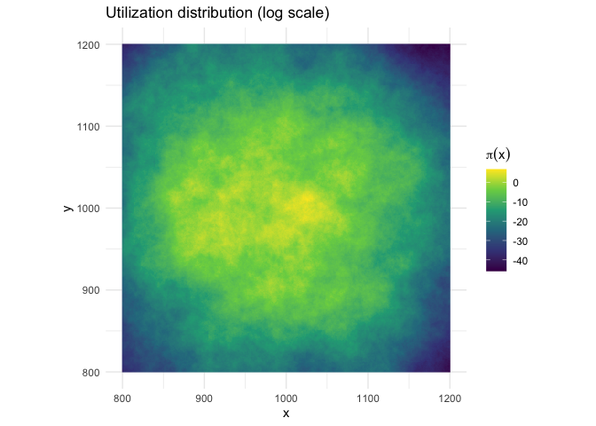
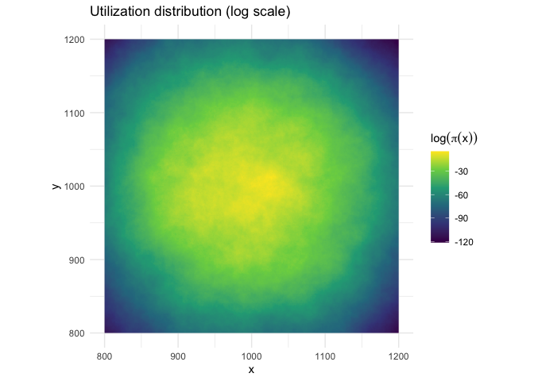
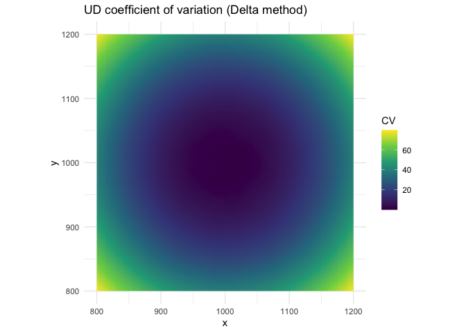
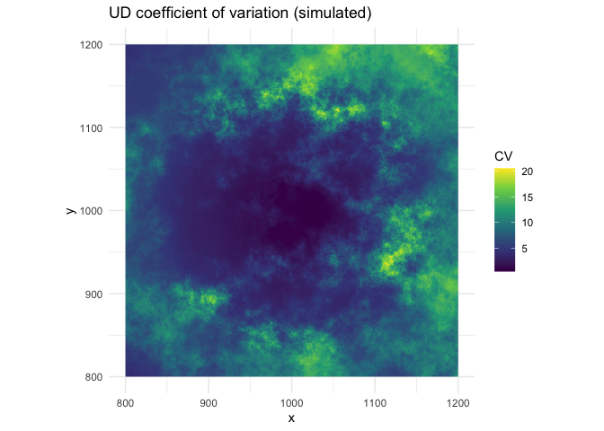
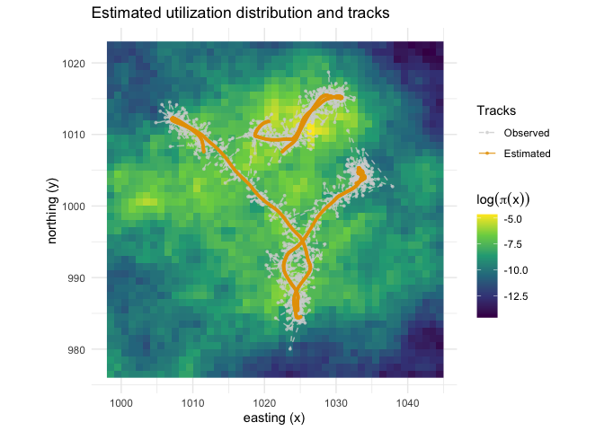
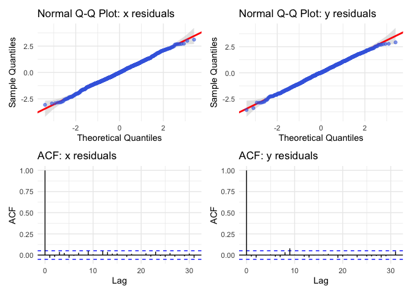
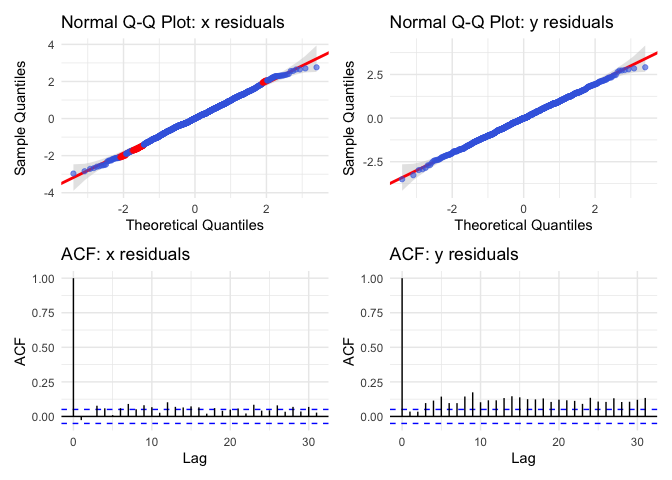
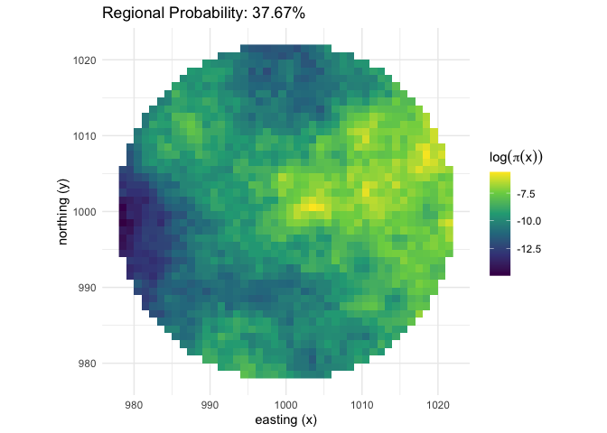
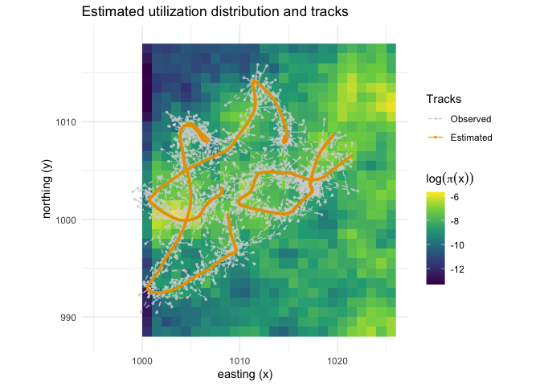

<!-- README.md is generated from README.Rmd. Please edit that file -->

# {langevinSSM}

#### Habitat-driven Langevin Diffusion with Spatial Uncertainty

`{langevinSSM}` is an R package for simulating and fitting the
habitat-driven Langevin diffusion to animal tracking data subject to
location measurement error and temporal irregularity. The habitat-driven
Langevin diffusion provides inferences about both habitat selection and
utilization distributions. The package provides tools for simulating
animal movement paths (`simLangevin`) and fitting the Langevin diffusion
model to observed tracking data (`fitLangevin`). It can also enforce
barrier constraints (e.g., land for marine animals). Location
measurement error can take the form of (older) Argos Least Squares-based
locations, (newer) Argos Kalman Filter-based locations with error
ellipse information, or general x- and y-axis errors (e.g. for GPS
data). The Langevin diffusion is a continuous-time model in state-space
form that estimates the underlying movement process while accounting for
location measurement error and associated uncertainty in the spatial
(habitat) covariates. Template Model Builder {TMB} is used for fast
estimation.

## Installation

One can install the `langevinSSM` package from CRAN using the following
command:

``` r
install.packages("langevinSSM") 
```

Alternatively, one can install the package from GitHub using the
`remotes` package:

``` r
remotes::install_github("bmcclintock/langevinSSM")
```

## Usage

To simulate animal movement paths using the Langevin diffusion model,
one can use the `simLangevin` function. For example:

``` r
library(langevinSSM)
library(ggplot2)
library(terra)
library(patchwork)

# Simulate an underdamped Langevin diffusion path

par <- list(beta = c(-4, 6, 5, -0.1), # habitat selection coefficients
            sigma = 5, # diffusion (or speed) parameter
            gamma = 0.5) # autocorrelation parameter

# calculate the true utiliziation distribution
## exampleCovs is a list of four spatial covariates (e.g., habitat features) that loads with the package
trueUD <- getUD(spatialCovs = exampleCovs, beta = par$beta)
```

<!-- -->

``` r

simDat <- simLangevin(model = "underdamped",
                      par = par,
                      spatialCovs = exampleCovs,
                      nbAnimals = 3)

head(simDat)
#>   id date   dt        x        y smaj smin eor x.err y.err     mu.x     mu.y
#> 1  1 0.00 0.00 1022.500 1007.500   NA   NA  NA    NA    NA 1022.500 1007.500
#> 2  1 0.01 0.01 1022.567 1007.562   NA   NA  NA    NA    NA 1022.567 1007.562
#> 3  1 0.02 0.01 1022.630 1007.624   NA   NA  NA    NA    NA 1022.630 1007.624
#> 4  1 0.03 0.01 1022.695 1007.685   NA   NA  NA    NA    NA 1022.695 1007.685
#> 5  1 0.04 0.01 1022.758 1007.745   NA   NA  NA    NA    NA 1022.758 1007.745
#> 6  1 0.05 0.01 1022.817 1007.804   NA   NA  NA    NA    NA 1022.817 1007.804
#>      vel.x    vel.y
#> 1 6.648996 6.362147
#> 2 6.358570 6.000276
#> 3 6.873469 6.151582
#> 4 6.219595 5.939985
#> 5 6.022555 5.840098
#> 6 5.937764 6.120124

# Simulate an underdamped Langevin diffusion path with measurement error
measurementError <- list(smaj.sd = 1.5,      # sd of semi-major axis of error ellipse
                         smin.sd = 0.75,     # sd of semi-minor axis of error ellipse
                         eor.lim = c(0,180)) # range of ellipse orientation (in degrees from north)

exampleDat <- simLangevin(model = "underdamped",
                         par = par,
                         spatialCovs = exampleCovs,
                         nbAnimals = 3,
                         obsPerAnimal = 500,
                         measurementError = measurementError)

head(exampleDat)
#>   id date   dt        x        y      smaj      smin       eor x.err y.err
#> 1  1 0.00 0.00 1022.110 1006.222 3.1904213 0.8238468 0.4407540    NA    NA
#> 2  1 0.01 0.01 1022.556 1007.537 0.2602149 0.1929297 0.8419944    NA    NA
#> 3  1 0.02 0.01 1021.443 1008.587 1.9072127 0.6294832 2.2160981    NA    NA
#> 4  1 0.03 0.01 1022.744 1007.630 0.1952989 0.0469546 2.2100417    NA    NA
#> 5  1 0.04 0.01 1023.498 1008.079 1.4343749 1.1175133 2.8685380    NA    NA
#> 6  1 0.05 0.01 1022.992 1008.429 0.8349596 0.1392169 0.4690632    NA    NA
#>       mu.x     mu.y    vel.x    vel.y
#> 1 1022.500 1007.500 6.648996 6.362147
#> 2 1022.567 1007.562 6.358570 6.000276
#> 3 1022.630 1007.624 6.873469 6.151582
#> 4 1022.695 1007.685 6.219595 5.939985
#> 5 1022.758 1007.745 6.022555 5.840098
#> 6 1022.817 1007.804 5.937764 6.120124
```

To fit the Langevin diffusion model to observed tracking data, one can
use the `formatData` and `fitLangevin` functions. For example:

``` r
# unformatDat is example data appropriate for formatData that loads with the package
head(unformatDat)
#>   id                date        x        y      smaj      smin       eor x.err
#> 1  1 2026-07-29 00:00:00 1022.110 1006.222 3.1904213 0.8238468  25.25334    NA
#> 2  1 2026-07-29 00:00:36 1022.556 1007.537 0.2602149 0.1929297  48.24272    NA
#> 3  1 2026-07-29 00:01:12 1021.443 1008.587 1.9072127 0.6294832 126.97307    NA
#> 4  1 2026-07-29 00:01:48 1022.744 1007.630 0.1952989 0.0469546 126.62606    NA
#> 5  1 2026-07-29 00:02:24 1023.498 1008.079 1.4343749 1.1175133 164.35512    NA
#> 6  1 2026-07-29 00:03:00 1022.992 1008.429 0.8349596 0.1392169  26.87534    NA
#>   y.err
#> 1    NA
#> 2    NA
#> 3    NA
#> 4    NA
#> 5    NA
#> 6    NA

# format the data for fitLangevin
exampleDat <- formatData(unformatDat, time.unit = "hours")

head(exampleDat)
#>   id                date   dt        x        y   lc      smaj      smin
#> 1  1 2026-07-29 00:00:00 0.00 1022.110 1006.222 <NA> 3.1904213 0.8238468
#> 2  1 2026-07-29 00:00:36 0.01 1022.556 1007.537 <NA> 0.2602149 0.1929297
#> 3  1 2026-07-29 00:01:12 0.01 1021.443 1008.587 <NA> 1.9072127 0.6294832
#> 4  1 2026-07-29 00:01:48 0.01 1022.744 1007.630 <NA> 0.1952989 0.0469546
#> 5  1 2026-07-29 00:02:24 0.01 1023.498 1008.079 <NA> 1.4343749 1.1175133
#> 6  1 2026-07-29 00:03:00 0.01 1022.992 1008.429 <NA> 0.8349596 0.1392169
#>         eor x.err y.err
#> 1 0.4407540    NA    NA
#> 2 0.8419944    NA    NA
#> 3 2.2160981    NA    NA
#> 4 2.2100417    NA    NA
#> 5 2.8685380    NA    NA
#> 6 0.4690632    NA    NA

# Fit the overdamped Langevin diffusion model to simulated data with measurement error
fit_over <- fitLangevin(model = "overdamped",
                   data = exampleDat,
                   spatialCovs = exampleCovs,
                   getJointPrecision = TRUE)  

fit_over
#> 
#> Habitat-Driven Langevin Diffusion Model
#> =======================================
#> Model type:        Overdamped 
#> Convergence:       Successful 
#> Max Log-Likelihood: -2530.959 
#> Optimization time:  0.32 seconds
#> 
#> Parameter Estimates (Natural Scale):
#> ---------------------------------------
#>           Estimate Std. Error
#> beta_cov1    3.031      6.312
#> beta_cov2    1.658      6.057
#> beta_cov3    4.755      5.403
#> beta_d2c     4.207      1.463
#> sigma        1.373      0.040
#> rho_o        0.000      0.000
#> tau_1        1.000      0.000
#> tau_2        1.000      0.000
#> psi          1.000      0.000

# Fit the underdamped Langevin diffusion model
fit_under <- fitLangevin(model = "underdamped",
                   data = exampleDat,
                   spatialCovs = exampleCovs,
                   getJointPrecision = TRUE)  

fit_under
#> 
#> Habitat-Driven Langevin Diffusion Model
#> =======================================
#> Model type:        Underdamped 
#> Convergence:       Successful 
#> Optimization time:  0.71 seconds
#> Max Log-Likelihood: -2059.125 
#> 
#> Parameter Estimates (Natural Scale):
#> ---------------------------------------
#>           Estimate Std. Error
#> beta_cov1  -3.9330      1.271
#> beta_cov2   5.6585      1.580
#> beta_cov3   5.7913      1.591
#> beta_d2c   -0.2631      0.201
#> sigma       4.7983      0.572
#> gamma       0.4455      0.111
#> rho_o       0.0000      0.000
#> tau_1       1.0000      0.000
#> tau_2       1.0000      0.000
#> psi         1.0000      0.000
```

### Post-processing functions

#### Utilization distribution

``` r
# calculate the estimated UD
UD <- getUD(spatialCovs = exampleCovs, 
            fit = fit_under, 
            nSims = 1000, # Monte Carlo simulation
            show_progress = FALSE)
```

<!-- -->

``` r

p_UD <- plotUD(UD)

# UD relative uncertainty (Delta method approximation)
p_UD$CV_delta
```

<!-- -->

``` r

# UD relative uncertainty (Monte Carlo simulation)
p_UD$CV_sim
```

<!-- -->

``` r

# plot the estimated (log) UD with the observed and estimated locations
plot(fit_under, spatialCovs = exampleCovs, data = exampleDat)
```

<!-- -->

#### Other S3 methods for `fitLangevin` objects

``` r
# fixed effect estimates
coef(fit_under) 
#>  beta_cov1  beta_cov2  beta_cov3   beta_d2c      sigma      gamma      rho_o 
#> -3.9329844  5.6585226  5.7913252 -0.2631432  4.7983181  0.4454611  0.0000000 
#>      tau_1      tau_2        psi 
#>  1.0000000  1.0000000  1.0000000

# confidence intervals for fixed effects
confint(fit_under) 
#>                2.5 %     97.5 %
#> beta_cov1 -6.4243270 -1.4416418
#> beta_cov2  2.5614194  8.7556258
#> beta_cov3  2.6723663  8.9102842
#> beta_d2c  -0.6566207  0.1303342
#> sigma      3.6777000  5.9189362
#> gamma      0.2274934  0.6634288
#> rho_o      0.0000000  0.0000000
#> tau_1      1.0000000  1.0000000
#> tau_2      1.0000000  1.0000000
#> psi        1.0000000  1.0000000

# confidence intervals for true locations
mu_ci <- confint(fit_under, parm= "mu") 

head(mu_ci)
#>   id                date mu.x_2.5% mu.x_97.5% mu.y_2.5% mu.y_97.5%
#> 1  1 2026-07-29 00:00:00  1022.307   1022.604  1007.432   1007.688
#> 2  1 2026-07-29 00:00:36  1022.381   1022.642  1007.501   1007.724
#> 3  1 2026-07-29 00:01:12  1022.453   1022.681  1007.567   1007.764
#> 4  1 2026-07-29 00:01:48  1022.522   1022.722  1007.631   1007.808
#> 5  1 2026-07-29 00:02:24  1022.589   1022.766  1007.692   1007.855
#> 6  1 2026-07-29 00:03:00  1022.653   1022.813  1007.749   1007.906

# AIC for comparing models with different fixed effects
AIC(fit_under) 
#> [1] 4130.25

# BIC for comparing models with different fixed effects
BIC(fit_under) 
#> [1] 4162.13
```

#### One-step-ahead residuals

``` r
# calculate one-step-ahead residuals for model diagnostics
res_under <- residuals(fit_under, data = exampleDat, spatialCovs = exampleCovs, ncores = 3)
res_under
#> 
#> === One-Step-Ahead (OSA) Residuals ===
#> Total observations: 1500 
#> Number of tracks:   3 
#> 
#> ---- Goodness-of-Fit Tests ----
#>  metric  statistic   p.value
#>    KS_x 0.01623411 0.8250146
#>    KS_y 0.02325261 0.3931915
#>  KS_mah 0.02366581 0.3714851
#>    LB_x 8.03971355 0.3291050
#>    LB_y 3.21740171 0.8641889
#>  LB_mah 5.83083916 0.5596346
#> -------------------------------
#> 
#> Residual Summary:
#>    residual.x         residual.y      
#>  Min.   :-3.03539   Min.   :-3.59504  
#>  1st Qu.:-0.66918   1st Qu.:-0.64664  
#>  Median : 0.00477   Median : 0.01418  
#>  Mean   : 0.01512   Mean   : 0.01724  
#>  3rd Qu.: 0.70205   3rd Qu.: 0.72569  
#>  Max.   : 3.09371   Max.   : 2.95225  
#>  NA's   :3          NA's   :3

# plot residuals to check model fit
p_under <- plot(res_under)
p_under$qq_x + p_under$qq_y + p_under$acf_x + p_under$acf_y + plot_layout(ncol=2)
```

<!-- -->

``` r

# can be used to compare "underdamped" vs "overdamped" models
res_over <- residuals(fit_over, data = exampleDat, spatialCovs = exampleCovs, ncores = 3)
res_over
#> 
#> === One-Step-Ahead (OSA) Residuals ===
#> Total observations: 1500 
#> Number of tracks:   3 
#> 
#> ---- Goodness-of-Fit Tests ----
#>  metric    statistic      p.value
#>    KS_x   0.01835388 0.6943096864
#>    KS_y   0.03702382 0.0330107286
#>  KS_mah   0.02090779 0.5296595534
#>    LB_x  27.69691301 0.0002495031
#>    LB_y 164.46091645 0.0000000000
#>  LB_mah   9.67064806 0.2080183389
#> -------------------------------
#> 
#> Residual Summary:
#>    residual.x          residual.y      
#>  Min.   :-3.061934   Min.   :-3.51075  
#>  1st Qu.:-0.637724   1st Qu.:-0.78183  
#>  Median :-0.012202   Median :-0.07414  
#>  Mean   : 0.002239   Mean   :-0.08122  
#>  3rd Qu.: 0.640902   3rd Qu.: 0.59904  
#>  Max.   : 2.975504   Max.   : 2.89001  
#>  NA's   :3           NA's   :3

p_over <- plot(res_over)
p_over$qq_x + p_over$qq_y + p_over$acf_x + p_over$acf_y + plot_layout(ncol=2)
```

<!-- -->

#### Conditional AIC

``` r
# calculate conditional AIC of Zheng et al. (2024)
cAIC(fit_under, data = exampleDat, spatialCovs = exampleCovs, nSims = 1000)
#> 
#> Conditional Akaike Information Criterion (cAIC)
#> ===============================================
#> cAIC:                  3544.24
#> Conditional NLL:       1573.89
#> -----------------------------------------------
#> Effective DF (EDF):    192.23
#> Trace Penalty:         5807.77
#> Fixed Effects (p):     6
#> Random Effects (q):    6000

cAIC(fit_over, data = exampleDat, spatialCovs = exampleCovs, nSims = 1000)
#> 
#> Conditional Akaike Information Criterion (cAIC)
#> ===============================================
#> cAIC:                  4298.24
#> Conditional NLL:       1458.07
#> -----------------------------------------------
#> Effective DF (EDF):    686.05
#> Trace Penalty:         2313.95
#> Fixed Effects (p):     5
#> Random Effects (q):    3000
```

#### Bhattacharyya’s affinity

``` r
# calculate similarity of true and estimated UDs using Bhattacharyya's affinity
rasterOverlap(exp(UD), exp(trueUD))
#> [1] 0.9275347
```

#### Regional presence probability

``` r
# create a spatial mask for the region of interest
d2c <- exampleCovs$d2c < 2.5

reg_prob <- regionProb(fit_under,
                       spatialCovs = exampleCovs, 
                       mask = d2c, # region of interest
                       nSims = 1000, # number of Monte Carlo simulations
                       show_progress = FALSE)

reg_prob
#> Regional Probability Estimate
#> =============================
#> Point Estimate: 0.3767
#> 
#> Delta Method Approximation:
#>   Standard Error: 0.1604
#>   95% CI:         [0.0623, 0.6911]
#> 
#> Monte Carlo Simulation:
#>   Standard Error: 0.1904
#>   95% CI:         [0.0000, 0.6681]
#>   (Based on 1000 draws)

plot(reg_prob, log = TRUE)
```

<!-- -->

### Spatial constraints (i.e., barriers)

To include barriers to movement (e.g., land for marine animals), the
`prepBarrier` function can be used to create a signed distance field
(SDF) from a binary raster mask (where 1 indicates allowed movement
areas and 0 indicates restricted movement areas). When included in
`spatialCovs` and identified by the `barrier` argument in `simLangevin`
and `fitLangevin`, the SDF is then included as part of a penalty term
with strength `lambda`:

``` r
# create a dummy barrier mask (left half restricted = 0, right half allowed = 1)
coast_barrier <- exampleCovs[[1]]
terra::values(coast_barrier) <- ifelse(terra::crds(coast_barrier)[, "x"]
                                       >= mean(terra::crds(coast_barrier)[, "x"]), 1, 0)
names(coast_barrier) <- "coast_barrier"

# convert mask to SDF and add to the spatial covariates list
# maskBuffer adds 1 cell buffer to barrier
exampleCovs_barrier <- exampleCovs
maskBuff <- maskBuffer(coast_barrier,bufferCells=1)
#> Warning: [distance] unknown CRS. Results can be wrong
exampleCovs_barrier$coast_barrier <- prepBarrier(maskBuff)
exampleCovs_barrier$d2coast <- exampleCovs_barrier$coast_barrier

# add a beta coefficient for d2c to the parameter list
# negative value indicates slight attraction to the "coast"
par_barrier <- par
par_barrier$beta <- c(par_barrier$beta, -0.1)

# simulate the data
simDat_barrier <- simLangevin(par = par_barrier,
                              nbAnimals = 3,
                              spatialCovs = exampleCovs_barrier,
                              barrier = "coast_barrier",
                              measurementError = list(smaj.sd = 1.5,
                                                      smin.sd = 0.75,
                                                      eor.lim = c(0,180)))

# actual penalty (lambda)
attr(simDat_barrier,"lambda")
#> [1] 4.003336

# Because by default lambda=NULL and simDat_barrier is a simLangevin object, 
# fitLangevin will automatically detect and use the exact barrier penalty (lambda) 
# that generated the data
fit_barrier <- fitLangevin(data = simDat_barrier,
                           spatialCovs = exampleCovs_barrier)
fit_barrier
#> 
#> Habitat-Driven Langevin Diffusion Model
#> =======================================
#> Model type:        Underdamped 
#> Convergence:       Successful 
#> Max Log-Likelihood: -1937.79 
#> Optimization time:  0.73 seconds
#> Barrier penalty:    4.003 
#> 
#> Parameter Estimates (Natural Scale):
#> ---------------------------------------
#>                Estimate Std. Error
#> beta_cov1    -2.5911915      0.890
#> beta_cov2     5.7723272      1.007
#> beta_cov3     5.5129991      1.111
#> beta_d2c     -0.0007732      0.695
#> beta_d2coast -0.0621138      0.085
#> sigma         4.9807858      0.277
#> gamma         0.5525815      0.083
#> rho_o         0.0000000      0.000
#> tau_1         1.0000000      0.000
#> tau_2         1.0000000      0.000
#> psi           1.0000000      0.000

plot(fit_barrier, data = simDat_barrier,
                  spatialCovs = exampleCovs_barrier,
                  maskRast = coast_barrier)
```

<!-- -->

``` r

# if lambda is not known, suggestLanbda can provide a ballpark estimate

# first fit baseline model with no barrier penalty
fit0 <- fitLangevin(data = simDat_barrier,
                    spatialCovs = exampleCovs_barrier,
                    lambda = 0)

lambda <- suggestLambda(fit0,max_dt = median(simDat_barrier$dt))

lambda
#> [1] 4.504518

fit_barrier_lambda <- fitLangevin(data = simDat_barrier,
                                  spatialCovs = exampleCovs_barrier,
                                  lambda = lambda)
fit_barrier_lambda
#> 
#> Habitat-Driven Langevin Diffusion Model
#> =======================================
#> Model type:        Underdamped 
#> Convergence:       Successful 
#> Max Log-Likelihood: -1938.061 
#> Optimization time:  0.76 seconds
#> Barrier penalty:    4.505 
#> 
#> Parameter Estimates (Natural Scale):
#> ---------------------------------------
#>               Estimate Std. Error
#> beta_cov1    -2.792085      0.960
#> beta_cov2     6.298263      1.079
#> beta_cov3     6.012598      1.196
#> beta_d2c      0.006108      0.754
#> beta_d2coast -0.071881      0.092
#> sigma         4.769155      0.255
#> gamma         0.597618      0.087
#> rho_o         0.000000      0.000
#> tau_1         1.000000      0.000
#> tau_2         1.000000      0.000
#> psi           1.000000      0.000

plot(fit_barrier_lambda, data = simDat_barrier,
                         spatialCovs = exampleCovs_barrier,
                         maskRast = coast_barrier)
```

<!-- -->

## Citation

If you use `{langevinSSM}` in your research, please cite it as follows:

    To cite package 'langevinSSM' in publications use:

      Dupont, F., McClintock, B.T., Fischer, J.-O., Marcoux, M., Hussey,
      N., and Auger-Méthé, M. (2026). Inferring resource selection and
      utilization distributions from irregular and error-prone animal
      tracking data. arXiv:2606.12566.

    A BibTeX entry for LaTeX users is

      @Article{,
        title = {Inferring resource selection and utilization distributions from irregular and error-prone animal tracking data},
        author = {Fanny Dupont and Brett T. McClintock and Jan-Ole Fischer and Marianne Marcoux and Nigel Hussey and Marie Auger-Méthé},
        journal = {arXiv},
        year = {2026},
        eprint = {2606.12566},
        primaryclass = {stat.ME},
        url = {https://arxiv.org/abs/2606.12566},
      }

    Additions and modifications to langevinSSM are frequent, to help with
    reproducibility of output please cite its version number. This is
    'langevinSSM' version 0.0.1
